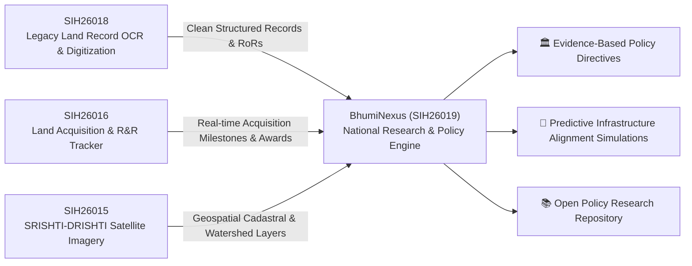
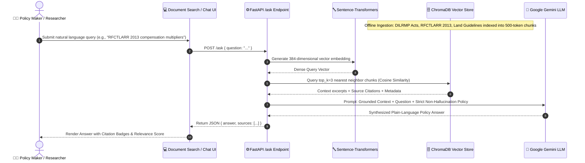
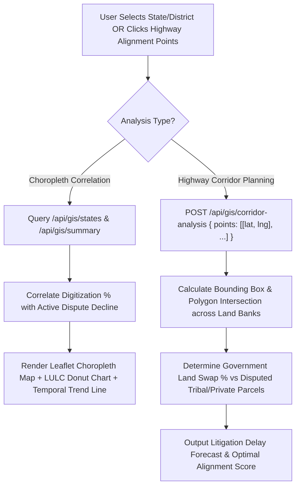
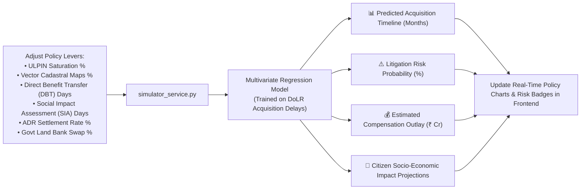
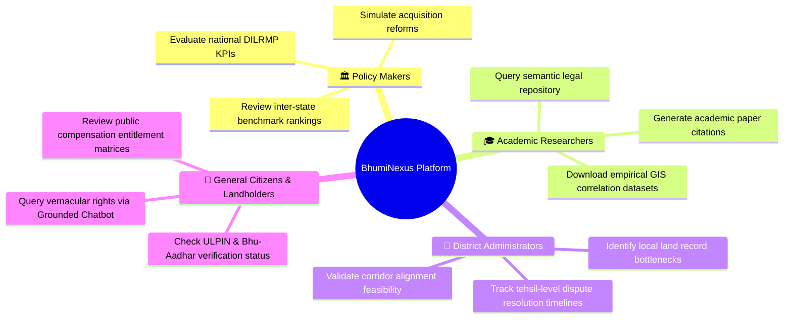

# 🇮🇳 BhumiNexus
### National Digital Platform for Research, Policy Innovation & Evidence-Based Land Governance

<br>
Links of our other REPOs : 
<br>
Collaborative Space - https://github.com/padmasri-web/collaborativeSpace-
<br>
DashBoard - https://github.com/jhalak101205-cpu/SIH_Frontend
<br>

[](https://sih.gov.in/)
[](https://sih.gov.in/)
[](https://sih.gov.in/)
[](https://dolr.gov.in/)

---

## 📌 Problem Overview

* **Problem Statement ID:** `SIH26019`
* **Title:** National Digital Platform for Research, Policy Innovation, and Evidence-Based Land Governance
* **Ministry / Department:** Ministry of Rural Development & Department of Land Resources (DoLR)
* **Category:** Software
* **Theme:** Smart Automation

### 🎯 The Challenge
India has vast volumes of land administration data — legacy cadastral maps, spatial datasets, satellite imagery, and land records under DILRMP. However, this wealth of data remains trapped in departmental silos. There is virtually no centralized, collaborative platform for researchers, policy-makers, and district administrators to evaluate land policy outcomes, predict bottlenecks, or conduct applied spatial research.

### 💡 Our Solution
**BhumiNexus** is a unified knowledge-to-policy engine. It bridges raw land governance data with actionable policy decisions through:
1. **AI Semantic Search (RAG):** Context-aware discovery across land policies, case studies, and legal frameworks.
2. **GIS Correlation Layers:** Interactive geospatial choropleths and corridor analysis connecting digitization with land litigation reduction.
3. **Evidence-Based Policy Simulator:** Machine-learning-powered "what-if" scenario analysis forecasting reform impacts before rollout.
4. **KPI-Grounded Conversational Assistant:** Fact-anchored policy chatbot preventing hallucinations.

---

## 🗺️ Architectural & Workflow Flowcharts

### 1. High-Level System Architecture Flowchart
The following flowchart illustrates the full-stack architecture connecting the React frontend, FastAPI backend services, AI RAG vector engine, and spatial GIS pipelines:

```mermaid
flowchart TD
    subgraph Frontend["🖥️ Frontend Application (React 19 + Vite + TailwindCSS)"]
        UI["BhumiNexus Core Dashboard"]
        GISComp["GIS Map Explorer (Leaflet.js + Recharts)"]
        SimComp["Policy & Route Simulator (Dynamic Sliders & Canvas)"]
        RAGComp["Document Research & Ask Bhumi AI"]
        ModalComp["SIH Architecture & Evaluator Modals"]
    end

    subgraph BackendAPI["⚙️ Backend API Gateway (FastAPI on Port 8000)"]
        Router["FastAPI Application (main.py)"]
        CORS["CORS & Network Binding (0.0.0.0)"]
        HealthRoute["/api/health & /api/gis/overview"]
        RAGRoute["/ask & /chat (RAG Engine)"]
        GISRoute["/api/gis/states, /geojson, /corridor-analysis"]
        SimRoute["/api/simulator/predict & /scenarios"]
    end

    subgraph IntelligenceLayer["🧠 Analytics & AI Engines"]
        subgraph RAGModule["RAG Semantic Search (rag_app)"]
            Embedder["Sentence-Transformers (all-MiniLM-L6-v2)"]
            ChromaDB[("ChromaDB Vector Store (Policy Chunks)")]
            LLM["Google Gemini API (Context Synthesis)"]
        end

        subgraph GISModule["GIS & Spatial Engine (services/gis_service.py)"]
            GeoJSONStore[("GeoJSON & Shapefile Layers")]
            CorridorEngine["Corridor Conflict & LULC Analyzer"]
            TemporalModel["DILRMP Digitization vs Dispute Correlation"]
        end

        subgraph SimModule["Policy Simulator (services/simulator_service.py)"]
            MLModel["Scikit-Learn Regression & Risk Model"]
            CityCoords[("National Indian City Coordinates DB")]
            SocioEconomic["Citizen Socio-Economic Impact Forecaster"]
        end
    end

    UI --> BackendAPI
    GISComp --> GISRoute
    SimComp --> SimRoute
    RAGComp --> RAGRoute
    
    RAGRoute --> RAGModule
    Embedder --> ChromaDB
    ChromaDB --> LLM
    
    GISRoute --> GISModule
    GISModule --> GeoJSONStore
    
    SimRoute --> SimModule
    SimModule --> MLModel
```



---

### 2. Ecosystem Alignment Flowchart (DoLR Cross-Platform Pipeline)
Rather than building an isolated silo, BhumiNexus acts as the analytical policy brain connecting feeds across the Department of Land Resources digital governance pipeline:



---

### 3. AI Semantic Search & RAG Knowledge Flowchart
The knowledge ingestion and query synthesis pipeline powering natural language search with source citations:



---

### 4. GIS Spatial Correlation & Corridor Analysis Pipeline Flowchart
How geospatial land layers, digitized RoR statistics, and highway corridor conflict points are evaluated:



---

### 5. Predictive Policy Risk Simulator Pipeline Flowchart
Step-by-step workflow of the interactive policy sandbox simulating land acquisition timelines:



---

### 6. User Persona Workspaces & Role Matrix
How different stakeholders utilize BhumiNexus:



---

## 🛠️ Technology Stack

| Layer | Technologies | Justification |
| :--- | :--- | :--- |
| **Frontend** | React 19, Vite, TailwindCSS, Lucide Icons | High-performance, clean UI with responsive dashboards |
| **Backend** | Python 3.10+, FastAPI, Uvicorn | Asynchronous, lightweight REST API with native AI/ML integration |
| **GIS & Mapping** | Leaflet.js, OpenStreetMap, GeoJSON | Lightweight, interactive geospatial choropleth rendering |
| **Data Visualization** | Recharts | Smooth temporal trendlines, LULC donut charts, and risk bars |
| **AI / Search** | Sentence-Transformers, ChromaDB, Gemini API | Strict fact-grounded RAG pipeline with verified source citations |
| **Simulation ML** | Scikit-learn, Pandas, NumPy | Fast, explainable regression and risk-classification models |

---

## 🚀 Getting Started Locally

### Prerequisites
- Node.js (v18+)
- Python (v3.10+)
- Git

### 1. Unified One-Click Hosting
Start both the Frontend and Backend servers with automatic port detection:

```bash
# Start on Localhost & LAN
./start_local.sh

# Stop all background services
./stop_local.sh
```

### 2. Manual Startup

#### Backend Setup
```bash
cd backend
python -m venv venv
source venv/bin/activate    # On Windows: venv\Scripts\activate
pip install -r requirements.txt
uvicorn main:app --host 0.0.0.0 --port 8000 --reload
```

#### Frontend Setup
```bash
cd frontend
npm install
npm run dev
```

Visit **`http://localhost:5173`** (or your LAN IP `http://192.168.88.2:5173`) to explore the platform.

---

## 📄 License
Smart India Hackathon 2026 Open Innovation Framework / Government of India Digital Initiatives.
