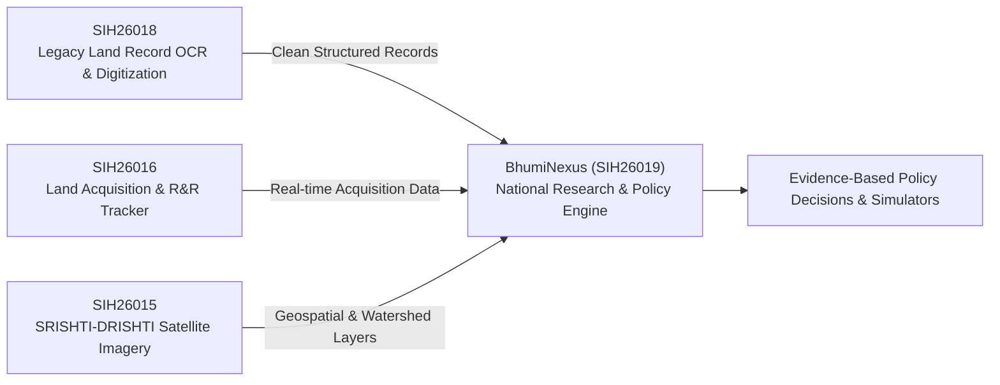

# 🇮🇳 BhumiNexus 
### National Digital Platform for Research, Policy Innovation & Evidence-Based Land Governance

[](https://sih.gov.in/)
[](https://sih.gov.in/)
[](https://sih.gov.in/)
[](https://github.com/jhalak101205-cpu/Team-NERO)

---

## 📌 Problem Overview

* **Problem Statement ID:** `SIH26019`
* **Title:** National Digital Platform for Research, Policy Innovation, and Evidence-Based Land Governance
* **Ministry / Department:** Ministry of Rural Development & Department of Land Resources (DoLR)
* **Category:** Software
* **Theme:** Smart Automation

### 🎯 The Challenge
India has vast volumes of land administration data — legacy cadastral maps, spatial datasets, satellite imagery, and land records under DILRMP. However, this wealth of data remains trapped in departmental silos. There is virtually no centralized, collaborative platform for researchers, policy-makers, and district administrators to evaluate land policy outcomes, predict bottlenecks, or conduct applied spatial research.

### 💡 Our Solution
**BhumiNexus** is a unified knowledge-to-policy engine. It bridges raw land governance data with actionable policy decisions through:
1. **AI Semantic Search (RAG):** Context-aware discovery across land policies, case studies, and legal documents.
2. **GIS Correlation Layers:** Visualizing district-wise correlations between record digitization and land dispute decline.
3. **Evidence-Based Policy Simulator:** Machine-learning-powered "what-if" scenario analysis to forecast reform impacts before rollout.
4. **KPI-Grounded Conversational Assistant:** Fact-anchored policy queries with zero hallucination.

---

## 🏛️ Ecosystem Alignment (The DoLR Data Pipeline)

Rather than building an isolated application, our platform acts as the **analytical brain** connecting the wider DoLR digital governance infrastructure:



---

## ✨ Key Features

### 1. 🔍 AI-Powered Research & Policy Library (RAG)
* Semantic document discovery over DILRMP reports, Land Stack guidelines, and legal frameworks.
* Powered by vector embeddings (`sentence-transformers`) and vector storage (`ChromaDB`).
* Answers natural language queries with exact source citations and zero hallucination.

### 2. 🗺️ GIS Research Correlation Explorer
* Interactive choropleth map powered by **Leaflet.js** and GeoJSON.
* Demonstrates the empirical relationship between **Land Record Digitization %** and **Dispute Counts** at state and district levels.
* Automated plain-language narrative synthesis accompanying every visual layer.

### 3. 🧪 Predictive Policy Risk Simulator (Key Differentiator)
* Interactive policy sandbox inspired by DoLR delay risk metrics (compensation timelines, court disputes, and R&R stages).
* Sliders enable policy-makers to test scenarios: *e.g., "If tehsil-level verification turnaround improves by 25%, by what margin do high-risk acquisition projects drop?"*
* Powered by lightweight, explainable predictive models (`scikit-learn`).

### 4. 💬 Grounded KPI Chatbot
* Conversational assistant linked directly to authoritative, pre-verified state indicators (ULPIN coverage, resolution times, digitization rates).
* Restricts responses strictly to verified metrics, preventing hallucinations.

---

## 🛠️ Technology Stack

| Layer | Technologies | Justification |
| :--- | :--- | :--- |
| **Frontend** | React.js, TailwindCSS, Lucide Icons | Responsive, clean UI with role-tailored dashboards |
| **Backend** | Python, FastAPI | High-performance asynchronous API, native AI/ML integration |
| **Database** | PostgreSQL + PostGIS | Officially recommended across DoLR problem statements |
| **GIS & Mapping** | Leaflet.js, OpenStreetMap | Lightweight, interactive geospatial choropleth rendering |
| **AI / Search** | Sentence-Transformers, ChromaDB / Elasticsearch, LLM API | High-accuracy RAG pipeline with semantic indexing |
| **Simulation ML** | Python, scikit-learn, Pandas, NumPy | Fast, explainable regression and risk-classification models |

---

## 👥 User Personas & Workspaces

* **🏛️ Policy Makers:** Test scenarios in the policy simulator, view national-level trend dashboards, evaluate reform SLAs.
* **🎓 Academic Researchers:** Access published land governance papers, analyze district datasets, annotate geospatial layers.
* **🏢 District Administrators:** Track local dispute resolution trends, identify tehsil-level bottlenecks, benchmark against peers.

---

## 🚀 Getting Started Locally

### Prerequisites
* Node.js (v18+)
* Python 3.10+
* Git

### 1. Clone the Repository
```bash
git clone https://github.com/jhalak101205-cpu/Team-NERO.git
cd Team-NERO
```

### 2. Backend Setup
```bash
cd backend
python -m venv venv
source venv/bin/activate    # On Windows: venv\Scripts\activate
pip install -r requirements.txt
uvicorn main:app --reload --port 8000
```

### 3. Frontend Setup
```bash
cd ../frontend
npm install
npm run dev
```

Visit `http://localhost:5173` to explore the dashboard.

---

## 🔮 Future Roadmap (Phase 2)
- [ ] Direct integration with live state Land Revenue Management Systems (LRMS) & Bhu-Aadhar (ULPIN).
- [ ] Ingestion of automated OCR pipeline feeds from legacy cadastral registers.
- [ ] High-resolution satellite tile streaming via NRSC / ISRO Bhuvan integration.
- [ ] Multilingual regional language interfaces (Bhashini API).

---

## 🏆 Team NERO
Developed with ❤️ for **Smart India Hackathon 2026**.
